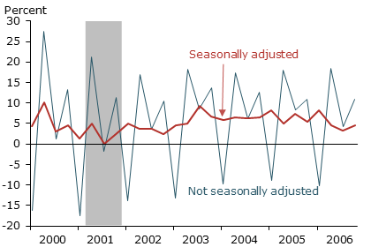
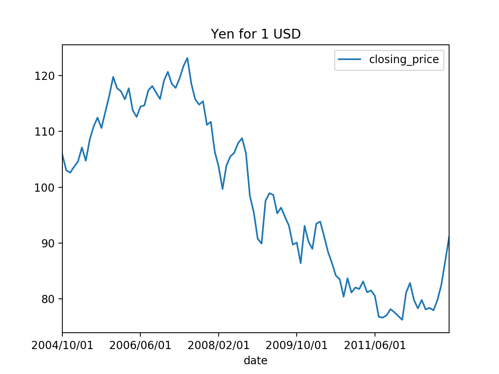
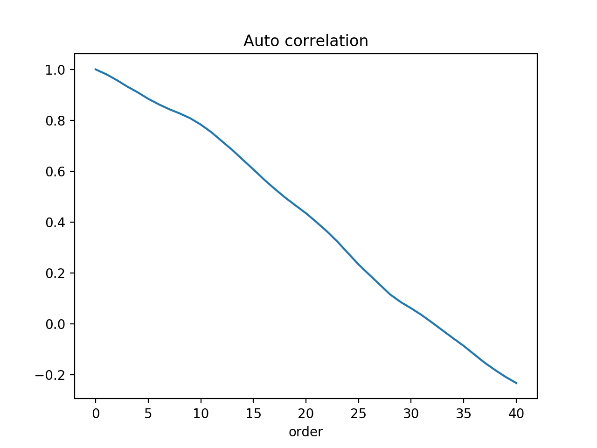

---
theme:"black"
transition: "default"
marp: true

---

# 線形時系列予測

---

### 季節調整値

原系列(original series)を加工して季節性(seasonality)と考えられる要素を修正した値
- GDPなどの経済指標を扱う場合、季節性よりも経済成長に伴う長期的変動や中期的な**景気循環**(business cycle)に関心がある。
- 季節性を取り除く方法
    - 基本は前後の数値で**平滑化**, 代表的なものに**移動平均**(moving average)がある

https://www.frbsf.org/economic-research/publications/economic-letter/2015/may/weak-first-quarter-gdp-residual-seasonality-adjustment/

---

### 移動平均の基本型

- 時系列データの原系列を$\{x_t\}_T$とする($T$: 時系列の長さ)。

時刻$t$のデータ$x_t$について前後$k$期ずつ計$2k+1$個のデータの算術平均を取る。
$$
y_t = \frac{1}{2k + 1}(x_{t-k} + \cdots + x_t + \cdots + x_{t+k})
$$
として新しい時系列$y_{k+1},y_{k+2}, \cdots y_{T-k}$を作る。

 
注：実際に日本の経済企画庁をはじめとする中央官庁や日本銀行が使用している季節調整法は移動平均法よりもはるかに複雑らしい

---
### 重み付き移動平均

加重平均を
$$
y_t = \sum_{i = -k}^k w_i x_{t+i}
$$
のように取ることもできる。
新しい系列$\{y_t\}$と原系列$\{x_t\}$の計量単位を揃えるために
$$
\sum_{i = -k}^k w_i = 1
$$
として、重みを全体で基準化することもしばしば行われる。

---
### 移動平均の中心化

- 多くの経済時系列データは月次データや四半期データなど偶数の周期を持つ。
- 移動平均の基本型で使う項数$2k + 1$は奇数。
- 月次データの場合、ある年の1月~12月の単純移動平均を取ると、中心となる月が6.5月になってしまう。
    - 同じ年の2月~翌年1月までを平均してその年の7.5月に対応する移動平均値を求める。
    - すでに求めた架空の6.5月と7.5月のデータの算術平均値をとれば、7月のデータに対応する季節調整値が求まる。

---

### 移動平均の中心化（数式編）

１年目の$t$月の現データを$x_{1:t}$で表すと、一年目の移動平均値（１つ目）は
$$
y_{1:6.5} = \frac{1}{12}(x_{1:2} + x_{1:3} + \cdots + x_{1:12}) 
$$

２つ目の移動平均値は
$$
y_{1:7.5} = \frac{1}{12}(x_{1:2} + x_{1:3} + \cdots + x_{2:1}) 
$$

よって一年目の7月の最終的な移動平均値$y_{1:7}$は

$$
y_{1:7} = \frac{1}{2}y_{1:6.5} + \frac{1}{2}y_{1:7.5}
$$

以上の手続きを一般化すると、原系列$\{x_t\}$から13項移動平均の系列$\{y_t\}$は
$$
y_t = \frac{1}{24}(x_{t-6} + 2\sum_{i=-5}^{5} x_{t + i} + x_{t+6})
$$

---
### 自己相関係数

- ２つの変数の関係を表す指標 → 相関係数
- 時系列データに適応すると、一つの時系列に対して多数の相関を考えられる。

データ$y_t$に対して$k$時点前のデータを$y_{t-k}$と表す。
時系列$\{y_t\}$と$k$時点前にずらした時系列$\{y_{t-k}\}$を別々の２つの時系列として、$k$時点前との関係を表す（標本）自己相関係数が定義できる。

| 時点$t$     | 1     | 2     | 3     | 4     | $\cdots$ | $\cdots$ | $T$       | $(T+1)$   | $(T+2)$ |
|-------------|-------|-------|-------|-------|----------|----------|-----------|-----------|---------|
| 原系列$y_t$ | $y_1$ | $y_2$ | $y_3$ | $y_4$ | $\cdots$ | $\cdots$ | $y_T$     | -         | -       |
| $y_{t-2}$   | -     | -     | $y_1$ | $y_2$ | $\cdots$ | $\cdots$ | $y_{T-2}$ | $y_{T-1}$ | $y_T$  |

---
相関係数の定義から、$\{y_t\}$と$\{y_{t-k}\}$の標本自己相関は
$$
r(k) = \frac{\sum_{t = k + 1}^{T}(y_t - \bar{y})(y_{t-k} - \bar{y})}{\sum_{t = 1}^{T}(y_t - \bar{y})^2}
$$

こうして求めた自己相関係数$r(k)$は時間差$k = 1, 2, \cdots, T-k$について考えられる。
$r(k)$を$k$次の**標本自己相関係数**という。

自己相関係数の系列$r(1), r(2), \cdots$のプロット図を**コレログラム**という。

--- 

2004年10月1日から2013年ドル円為替

